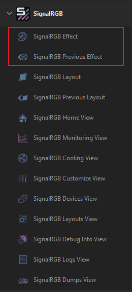

# SignalRGB-Deck Plugin (for StreamDeck)

## Description

SignalRGB-Deck is not an official plugin. I am not associated with SignalRGB or Whirlwind in any manner (except being a huge fan).

This plugin is designed to perform a few different types of actions:

- Apply SignalRGB Effects: For any SignalRGB effect you have installed, it will appear as an option in the action's `SignalRGB Effect` dropdown menu. When a new Effect is selected, its unique settings will appear below it in the section titled `Effect Settings`. Essentially, this means that you can store many different profiles for the same SignalRGB Effect.
- Apply one of your SignalRGB layouts: SignalRGB-Deck will find all of your existing layouts and allow you to create shortcut actions.
- Launch SignalRGB Views: A SignalRGB View is typically associated with items in the left-hand nav bar of the SignalRGB app. For instance, you can assign a StreamDeck button to an action that opens SignalRGB directly to the `Layouts` section of the SignalRGB app.

In all honesty, this plugin isn't anything that you couldn't already do with existing StreamDeck plugins, it's just that the 
SignalRGB-Deck plugin makes it a whole lot easier (as opposed to bangin' yer way thru a big, gross Windows Bat plugin command or playing keyboard shortcut games).

> [!NOTE]
> SignalRGB-Deck can only detect SignalRGB Effects that are actually installed to your local machine. In other words, it is not capable of making remote requests to SignalRGB's Effect Hosting Service in order to download and install a new Effect.

## Available SignalRGB Actions

SignalRGB-Deck Plugin contains am action for mapping Effects and Layouts to StreamDeck buttons and several others for launching SignalRGB Views.

Effect Actions

Layout Actions

View Actions

## The SignalRGB Effect Actions

### Custom Effect Actions

From the actions list, drag the action titled `SignalRGB Effect` onto one of your StreamDeck buttons. In the action's Property Inspector (action settings) you'll now see an empty dropdown menu labeled as `SignalRGB Effect`. Simply choose the Effect you'd like apply when that button is pressed. Upon selecting the desired effect, you'll be presented with that Effect's unique settings. Each SignalRGB Effect has its own custom properties and, as such, each time you select a new Effect, you'll see that property list change.

> [!IMPORTANT]
> While it's possible to fully configure an Effect to your liking using only the StreamDeck settings, you won't get a realtime view of what's happening. SignalRGBs current API just doesn't support it (likely doesn't need to...). As such, your best bet here is to use launch the `Customize View`, then, in the SignalRGB app, apply the desired effect and then configure it. When done, simply copy the settings from SignalRGB over to SignalRGB-Deck plugin (they should always match one for one and will always share the same name).

Here is a clipped view of an Effect's settings as seen from the SignalRGB app:

And, when you choose the same Effect from the SignalRGB-Deck Plugin, you'll see:

> [!NOTE]
> For the most part, all of the SignalRGB properties you might see in the StreamDeck settings are represented by intuitive surrogate controls. For instance, a SignalRGB range setting is shown as a simple slider control and a SignalRGB color selector shows a standard color picker control. The one exception to this is with SignalRGB's "hue control". This is a numerical value between 0 and 359 that alters the (you guessed it) hue of some Effect property. The SignalRGB app presents this control with a nice colored bar slider so you can see how the changes manifest themselves. Unfortunately, there is no out of the box equivalent control for StreamDeck and I'm not up for making a custom one.

> [!WARNING]
> Navigating away from the current Effect to a new one will cause you to lose any work you've put into configuring it (even if you select it again). Effects will always load with their properties set to default values.

### Previous Effect Action

You can also use SignalRGB-Deck to create a shortcut to your last used SignalRGB effect. In order to do this, drag the action titled `SignalRGB Previous Effect` onto one of your StreamDeck buttons. There are no settings for this action.

## The SignalRGB Layout Actions

### User Layout Actions

From the actions list, drag the action titled `SignalRGB Layout` onto one of your StreamDeck buttons. In the action's Property Inspector (action settings) you'll now see an empty dropdown menu labeled as `SignalRGB Layout`. Simply choose the Layout you'd like apply when that button is pressed.

### Previous Layout Action

You can also use SignalRGB-Deck to create a shortcut to your last used SignalRGB layout. In order to do this, drag the action titled `SignalRGB Previous Layout` onto one of your StreamDeck buttons. There are no settings for this action.

## The SignalRGB View Actions

SignalRGB currently supports opening of specific views within itself through the use of "application URLs". SignalRGB-Deck takes advantage of this and maps all available URLs to a StreamDeck action. To use one, just locate the desired view in the actions list and drag it into one of your StreamDeck's buttons. Pressing this button will open the corresponding view in the SignalRGB app.

> [!NOTE]
> There is a known issue where launching a SignalRGB View when the SignalRGB app already has focus will cause the app to minimize itself. I can't do anything about this without gross Windows hackery. There is probably a reasonable assumption that the application URLs the plugin relies upon are used when the app *does not* have focus.

## Credit and Thanks

A huge thanks to:
 - [BarRaider](https://barraider.com/) for allowing us all to use their excellent [StreamDeck Tools](https://github.com/BarRaider/streamdeck-tools) to build plugins.
 - [SignalRGB](https://www.signalrgb.com/) for attempting to unify the un-unifiable.

